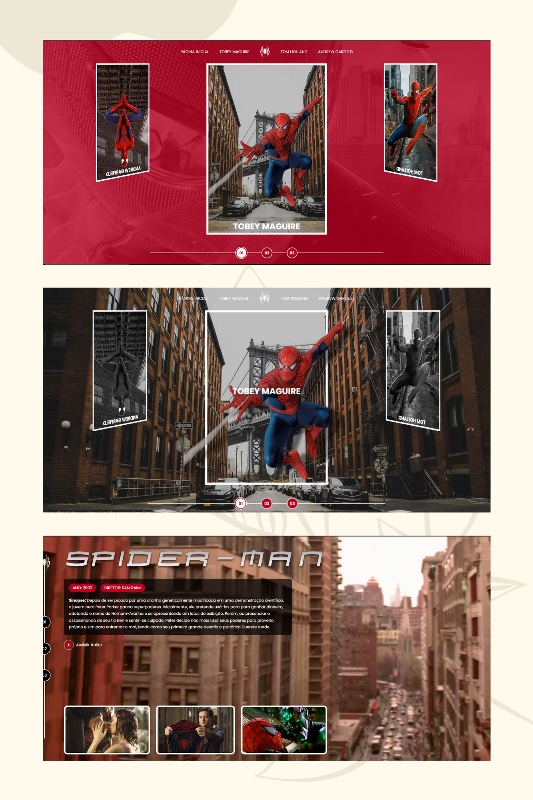

# Projeto Spider-Man Multiversos

Nesse projeto foi utilizada a metodologia BEM ou Block Element Modifier para nomeação de classes em CSS.

##

## 🚀 Tecnologias

- Javascript
- HTML
- CSS
- Git e Github
